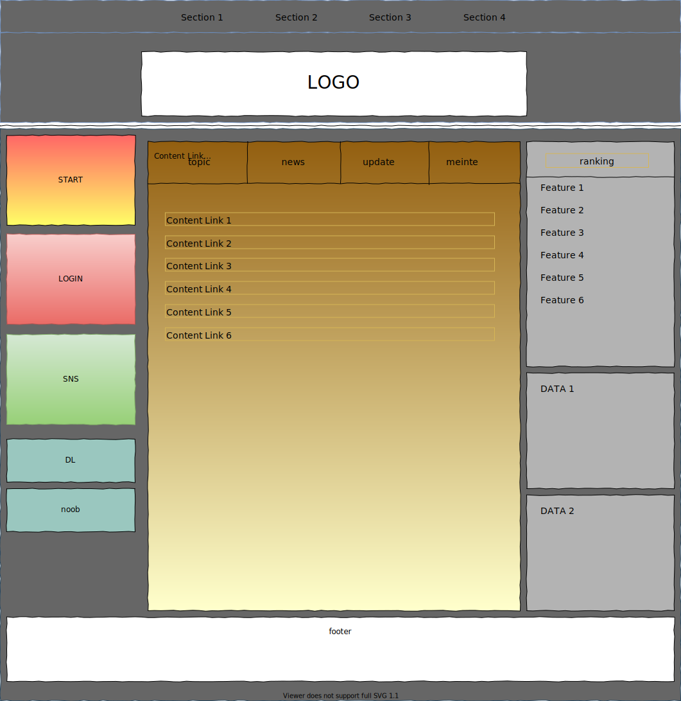

# トップページデザイン

# コンテンツ詳細

## 1. Section 1 - 4  
ヘッダー部

## 2. LOGO  
ロゴ部

## 3. START  
ゲームスタートUI

## 4. lOGIN  
ログインUI  
Goolgeや他APIログインも含む

## 5. SNS  
Twitter,instagram,youtube,etc...

## 6. DL  
クライアントダウンロード部

## 7. noob  
初心者虎の巻

## 8. Content Link(topic,news,update,meinte)  
新着情報、ニュース、更新情報、メンテナンス情報のリンクを記載  
コンテンツは別で制作する  
タブごとに表示される内容を切り替える

## 9. ranking  
ランキングが表示される、内容は未定

## 10. data1  
未定

## 11. data2  
未定

## 12. footer  
フッター部  
著作権情報を表示  
他リンクなど